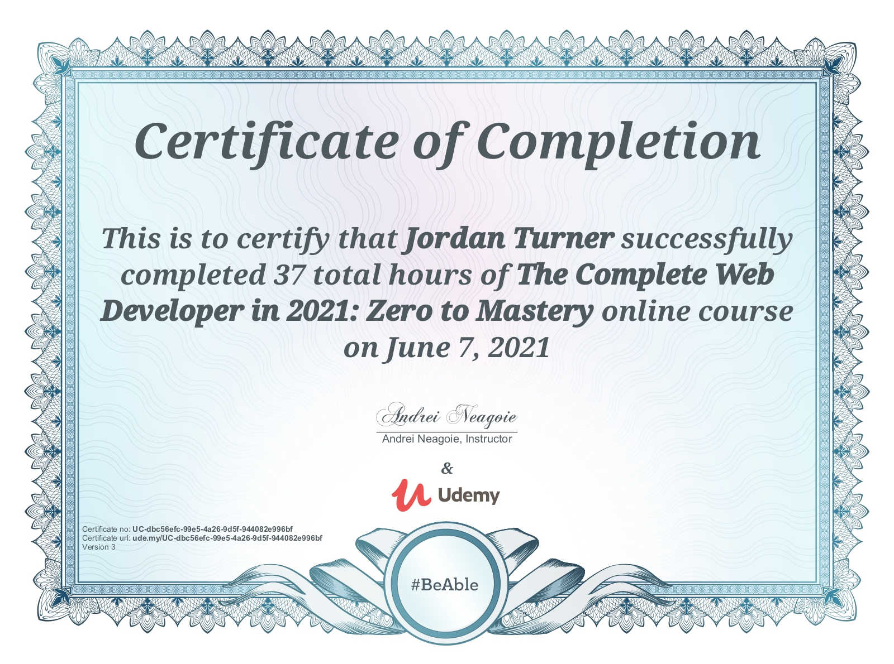

<!-- ### Hi there, I'm Jordan - aka [TheNamesJT] 👋
 -->

## I'm a Gamer, and Aspiring Front-End Developer!

- 🌱 I’m currently learning everything 🤣
- 👯 I’m looking to collaborate with other content creators
- 🥅 2020 Goals: Contribute more to Open Source projects & To Get Out of Tutorial Hell
 

  

 

<!-- ### Connect with me:
[][youtube]
[][twitter]
[][instagram]
  -->

### Languages and Tools:

  
  

  
 
 
 
 

### Certifications 

 
 
 

<!-- [twitter]: https://twitter.com/TheNamessJT
[youtube]: http://www.youtube.com/c/TheNamesJT
[instagram]: https://www.instagram.com/thenamessjt/ -->
